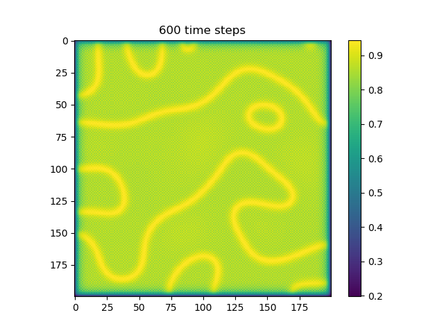
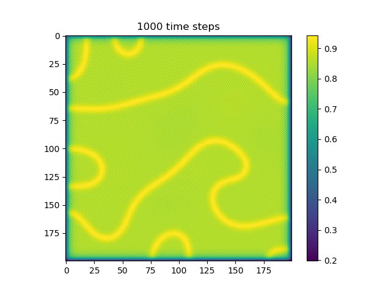

## [Home](https://jzerez.github.io/swarms/mainpage) &nbsp;&nbsp;&nbsp;&nbsp;&nbsp;&nbsp;&nbsp;&nbsp;[Blog Post 1](https://jzerez.github.io/swarms/blogpost1) &nbsp;&nbsp;&nbsp;&nbsp;&nbsp;&nbsp;&nbsp;&nbsp;[Blog Post 2](https://jzerez.github.io/swarms/blogpost2)

# Blog Post 1
### Introduction
So far, we've already implemented one of the key features of our project that will allow us to test and tune some algorithm specific parameters in a short amount of time. Specifically, we were able to implement a simplified reaction-diffusion simulation using 2D arrays in numpy. This is important to the project because we are planning on using reaction-diffusion patterns in order to influence how the agents move around and ultimately impact the final shape of the emergent pattern. In this post, we will describe some of the math and implementation details of the reaction-diffusion implementation, and show off some of the results that stem from a few input parameters.

### The Details
Reaction diffusion patterns arise through a number of different phenomena: diffusion, chemical reaction, and artificial chemical limiting. In our implementation, there are two chemical concentrations that are associated with each space in our 2D array. We call them chemical `A` and chemical `B`.

#### Diffusion
At each time-step, both chemicals are allowed to diffuse. Diffusion at a location is proportional to the divergence of the chemical at that location. In other words, for a given tile, if it's neighbors all have lower concentrations of a chemical, some of the chemical from the given tile will move to the neighboring tiles and vice versa. This has the effect of "smoothing out" the gradient of both chemicals over time. We calculate the divergence of each tile by using `correlate2d` with a kernel that compares the values of the surrounding tiles to the target tile. This allows us to quickly recalculate the divergence each time step.

Because we know that diffusion is only proportional to the divergence, we need to initialize a constant `cA` and `cB` that are the proportional constants for diffusion for `A` and `B`

#### Reaction
The two chemicals are allowed to react with each other. In our implementation, `A` reacts to form `B`. The rate of reaction is dictated by the equation `r = A * B**2`. At each timestep, for the given concentrations of `A` and `B` at each tile, we convert some of `A` into `B` following the equation above.

#### Artificial Chemical limiting
If we were to let the reaction go on forever, we would be left with no `A` and all `B`. To remedy this, at each timestep, we add in `A` and remove `B` from each cell. We add in `A` inversely proportional to the current concentration of `A` (the less `A` there is at a given time step, the more `A` we add in). Conversely, we take away `B` proportionally to the current concentration of `B` (the more `B` there is at a given time step, the more `B` we take away). This ensures that the reaction can continue. We initialized a constant `a_add_rate` and `b_add_rate` for these proportional relationships.

### Results
Below are some results that we've found after playing around with some of the parameters. We note that the simulation is really sensitive to input parameters, as if they are too high, then the concentrations of either chemical could potentially blow up to infinity.

| Number of Steps| `ca=0.21`, `cb=0.26`, `a_add_rate=0.055`, `b_add_rate=-0.117`     | `ca=0.2`, `cb=0.5`, `a_add_rate=0.055`, `b_add_rate=-0.117`      |
| :------------- | :----------: | -----------: |
|  200  |   |     |
| 400   |  |  |
| 600   |  |  |
| 800   |  |  |
| 1000   |  |  |
