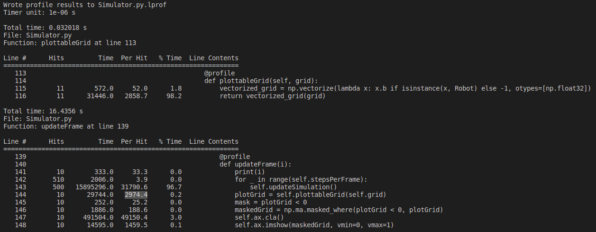
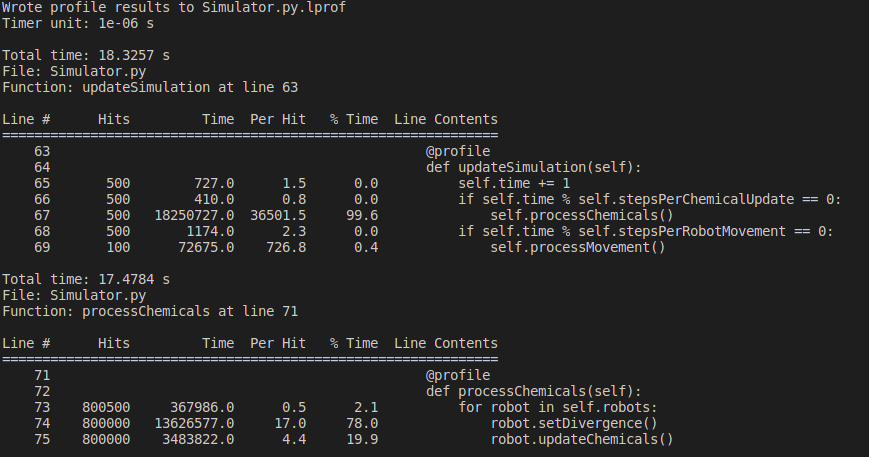

## [Home](https://jzerez.github.io/swarms/writeups/mainpage/main) &nbsp;&nbsp;&nbsp;&nbsp;&nbsp;&nbsp;&nbsp;&nbsp;[Blog Post 1](https://jzerez.github.io/swarms/writeups/blogpost1/blogpost1) &nbsp;&nbsp;&nbsp;&nbsp;&nbsp;&nbsp;&nbsp;&nbsp;[Blog Post 2](https://jzerez.github.io/swarms/writeups/blogpost2/blogpost2)
# Blog Post 2
### Introduction
Since the last blog post, we've been hard at work on our project, implementing an agent based simulation to visualize reaction-diffusion patterns. While using numpy arrays allows us to leverage computationally efficient computing methods, we need an agent based model if we want to implement swarm behavior. One of the drawbacks of this modeling approach is that it is a lot slower than our initial simple implementation in `rd.py` with solely numpy arrays. In line with our learning goal of writing code with a focus on optimization, we took a step back to evaluate and improve our code's runtime.

### Analyzing the Runtime
To analyze the runtime, we remembered a lecture back in Software Design a couple years ago that used a package called [Line Profiler](https://pypi.org/project/line-profiler/). With this package, you can get data on the runtime of functions as you run the code. You can see examples below. To start, we looked at our main function `updateSimulation()`. We hypothesized that our robot movement code was taking the most time, but we were surprised when it turned out that the process chemicals function, `processChemicals()`, was taking over 99.95% of the total runtime for each update of the simulation (Line profiler rounded it to 100.0%). After analyzing `processChemicals()`, we found that the setting the divergence in each robot from its neighbors took about 90% of that function. Based on that, we tried to optimize the code that set the divergence.



### Optimizing the Runtime
Before running Line Profiler on our code, we were using a `numpy` function called `numpy.vectorize()` which allows you to apply a function to an array in an elementwise manner. We were calling this function on a 3x3 array of neighbors for each robot object in the simulation. Because the 3x3 array of neighbors can contain robot objects or just integers (which represent spaces with no robots in them), we needed to use a function on each element in order to just get chemical concentrations. As such, we used `numpy.vectorize()` to do so. Our code looked something like this:

```
vec = np.vectorize(lambda x: getattr(x, attr) if isinstance(x, Robot) else 0, otypes=[dtype])
return vec(self.neighbors)
```

We found that this code was really inefficient, which is kind of weird given that it is a part of `numpy`. We played around with a few different ways to achieve the same results and found that simply iterating through a flattened version of the array was vastly more efficient. In fact, we found that it improved the runtime of the `calcDivergence()` by a factor of about 10! Because this function accounted for the vast majority of the run time originally, we decreased the run time of the entire project by about a factor of 8. 

Below is a picture of the output of Line Profiler with our current implementation. `processChemicals()` still accounts for the majority of the runtime (99.6%), but it is substantially faster than it was before. 



In the future, we could work to potentially calculate the divergence in a way that is closer to how we did it in `rd.py`, where we take advantage of efficient correlation algorithms provided by `scipy`. But for now, this massive speed up is sufficient and is helping us to debug our code much faster. 