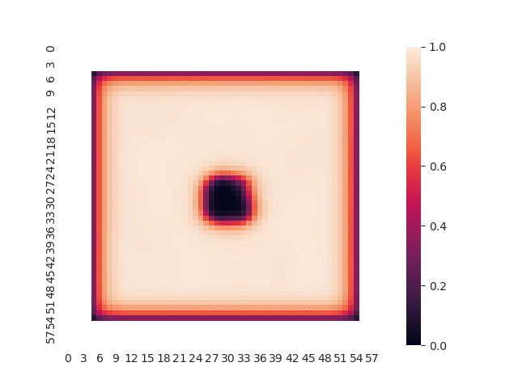
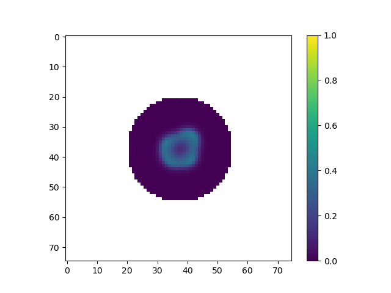

## [Home](https://jzerez.github.io/swarms/mainpage) &nbsp;&nbsp;&nbsp;&nbsp;&nbsp;&nbsp;&nbsp;&nbsp;[Blog Post 1](https://jzerez.github.io/swarms/blogpost1) &nbsp;&nbsp;&nbsp;&nbsp;&nbsp;&nbsp;&nbsp;&nbsp;[Blog Post 2](https://jzerez.github.io/swarms/blogpost2)

# Project Gallery
This page contains a gallery of the various interesting visuals we've produced over the course of this project. All of the animations and images can be found in the `./media` folder. The filenames contain the reaction-diffusion parameters used for that simulation. The structure is as follows:

`cA_cB_aAddRate_bAddRate_n_frames.gif`

For instance, 
`0.4_0.2_0.039_-0.104_2000_frames.gif`
is a gif generated from a simulation where: 
* `ca=0.45`
* `cb=0.3`
*  `a_add_rate=0.035`
* `b_add_rate=-0.067`
* There were 2000 time-steps in the simulation.

### Figure 1:
`ca=0.45, cb=0.3, a_add_rate=0.035, b_add_rate=-0.067`

This shows the very first implementation of our reaction-diffusion simulation with robotic agents. While it is really interesting to look at, it actually is not correct. Notably, the patterns do not persist over time, and the gradient between cells is very high (notice how the entire grid is like a checker-board: every other space has close to zero concentration).

### Figure 2:
`ca=0.4, cb=0.2, a_add_rate=0.039, b_add_rate=-0.104`

This shows a very early visualization of the reaction-diffusion simulation that actually works. We hadn't yet implemented robot movement.

### Figure 3:
`ca=0.4, cb=0.2, a_add_rate=0.039, b_add_rate=-0.104`

This shows our first implementation of the model with robot movement. We hadn't yet properly tuned the reaction diffusion parameters to get the high concentration islands close enough to the edge of the swarm. As such the moving robot constantly traverses the edge of the swarm and is unable to become satisfied.

### Figure 4:
`ca=0.4, cb=0.2, a_add_rate=0.039, b_add_rate=-0.104`

Similar to the previous image, we hadn't yet tuned the reaction diffusion parameters to get the high concentration islands close enough to the edge of the swarm. The pattern stagates before creating anything interesting.

### Figure 5:
`ca=0.4, cb=0.19, a_add_rate=0.041, b_add_rate=-0.104`

This simulation doesn't show anything interesting, but is just cool to look at. 

### Figure 6:
`ca=0.5, cb=0.25, a_add_rate=0.06, b_add_rate=-0.124`

This one is smiling :)
