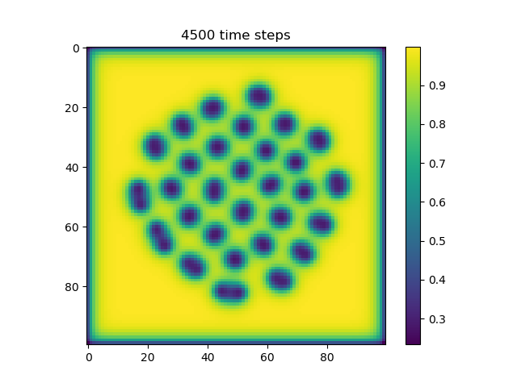
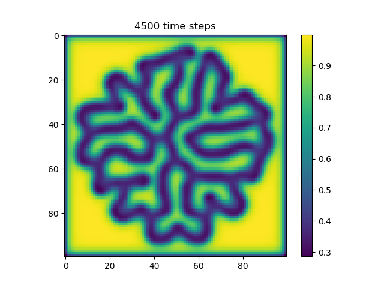
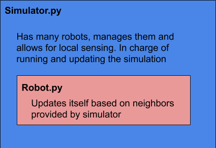
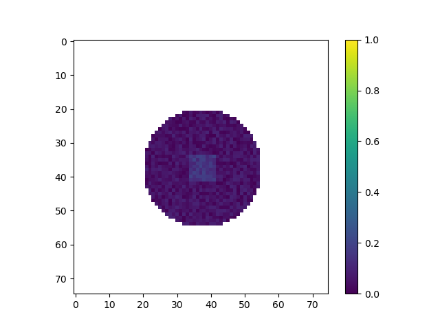
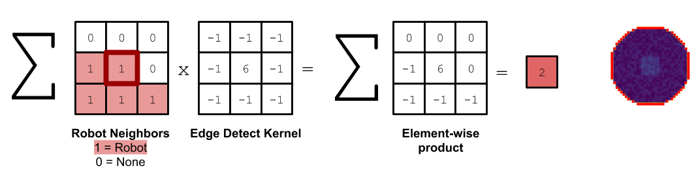
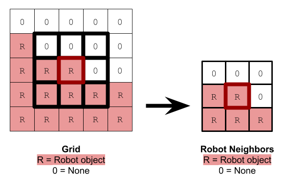
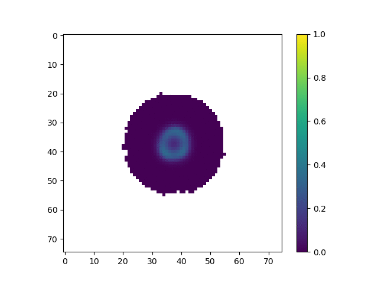

## [Home](https://jzerez.github.io/swarms/mainpage) &nbsp;&nbsp;&nbsp;&nbsp;&nbsp;&nbsp;&nbsp;&nbsp;[Blog Post 1](https://jzerez.github.io/swarms/blogpost1) &nbsp;&nbsp;&nbsp;&nbsp;&nbsp;&nbsp;&nbsp;&nbsp;[Blog Post 2](https://jzerez.github.io/swarms/blogpost2)
# Swarms
**ENGR3590: A Computational Introduction to Robotics, Olin College of Engineering, FA2020**

*Nathan Estill, Jonathan Zerez*

 

In this project, we set out to create a simulated decentralized robot swarm that would exhibit self-assembling properties. Specifically, we wanted to replicate morphogenesis, the process by which cells are able to self-organize themselves in order to form complex tissues and organs through local interactions alone. This is of great interest to us, as decentralized systems are full of complexity, and are quite different from centralized robotic systems. Decentralized swarms offer a number of really cool advantages in that they are very robust to external noise, damage to a number of individual agents within the swarm, and unpredictable variations in the environment. 

## Introduction
For this project, we created a 2D simulation of simple robotic agents on a grid world. These agents are allowed to communicate and sense their nearest neighbors, and are allowed to move with discrete steps around the grid. By implementing that dictate how the robots interact with each other and how they move, we are able to get the swarm to self assemble into complex shapes. 

We accomplished this by first implementing a simulated reaction-diffusion system among the robotic agents. This would create virtual reaction-diffusion patterns in the swarm of areas with high and low chemical concentrations. From here, we instructed robots on the edge of the swarm to move until they were able to find locations of sufficiently high chemical concentrations. The movement of the agents in some cases, helped the reaction-diffusion patterns to further evolve, driving the entire structure of the swarm to change over time. 

This project was inspired by [*Morphogenesis in Robot Swarms*](https://robotics.sciencemag.org/content/3/25/eaau9178) by I. Slavkov et. al. They successfully modeled and physically implemented a [Kilobot](https://www.k-team.com/mobile-robotics-products/kilobot) swarm that underwent simulated reaction-diffusion using virtual chemicals, and exhibited complex emergent behavior of self assembly. We set out to replicate this work and to see if we could produce any patterns that were more interesting.

## Theory: Reaction-Diffusion
Reaction-Diffusion was used to create the patterns that drove the movement patterns of the robot. As it is an important part of the project, we will briefly describe what a Reaction-Diffusion system is and how it works in this section below. 

Reaction diffusion patterns arise through a number of different phenomena: diffusion, chemical reaction, and artificial chemical limiting. In our implementation, there are two chemical concentrations that are associated with each robot in the grid. We call them chemical `A` and chemical `B`.

Over time, the chemicals are allowed to diffuse, meaning that areas of high concentrations will tend to flatten out over time. Diffusion at a location is proportional to the divergence at that location. 

Chemicals are also allowed to react with each other. In our case, chemical `A` forms chemical `B`, as dictated by the following equation:

 

Finally, we artificially limit chemical concentrations by constantly adding in chemical `A` and constantly removing chemical `B` in order to ensure the reaction-diffusion system can keep going without achieving a boring equilibrium point. 

If we add all of these terms up, we find that the rate of change for chemical `A` is:

)
\
\
And similarly for chemical `B`:

)

\
\
In both equations, the first term corresponds to diffusion of the chemical and is proportional to the divergence of that chemical. The second term is the reaction, and the final term is the artificial chemical limiting. Note, we refer to `lA` and `lB` as `a_add_rate` and `b_add_rate` in this project. 

Below are some examples of reaction-diffusion patterns:
|  |  |
| ---------- | --------- |
| `ca=0.5, cb=0.25, a_add_rate=0.039, b_add_rate=-0.104` | `ca=0.5, cb=0.25, a_add_rate=0.055, b_add_rate=-0.117` |

For more information about Reaction-Diffusion, see our [first blogpost](../blogpost1/blogpost1.md) on the subject. 

## Implementation Details
### Overview
The project contains two main objects, a `Simulator` object and a `Robot` object. The `Simulator` object contains all of the `Robot` objects and is responsible for managing their mutual localized sensing. Each `Robot` is responsible for updating itself based on the neighbors provided to it by the `Simulator` object. 

The `Simulator` contains a 2D `numpy` array that contains all of the robots, as well as any empty spaces. The position of each robot is equivalent to its x and y indices in the 2d grid array. Each robot's position is discrete and corresponds to a grid location: there is no continuous motion in the simulation. 

The robotic agents were modeled after Kilobots. The Robot class contains its chemical concentrations of `A` and `B`, its position, reaction diffusion parameters, and notable kernels. Each robot is able to communicate with other nearby robots. If a robot is broadcasting a message, only robots in the eight gridspaces directly adjacent to its current position will be able to receive the message. Like Kilobots, our implemented robots are able to determine how far away the origin of a signal is, but are unable to determine what direction the signal is coming from.

### Simulation

We start with a simulation of many small robots in a space. Initially, they are arranged in a circle in the center of the grid. All robots have an initial chemical concentrration of `A=1`. The chemical concentration of `B` for each robot varies randomly from 0 to 0.1. Additionally, robots in the center of the circle are given an additional 0.1 of `B` in order to get the reaction started. The initialized grid is shown below.

After initializing the grid and the robots within it, we calculate and store the set of robots that are on the edge of the grid, as shown below. This is important as robots on the edge require extra updates for each timestep. Keeping track of which robots are on the edge of the shape ensures that we can minimize the runtime by avoiding running costly update functions on robots that don't need it. The figure below shows in red which robots are considered to be at the edge of the swarm for the initial starting grid. 

The simulation is tasked with updating the neighbors to each robot. Because we store the robots in a 2D array, this task is relatively simple. Getting the neighbors of a robot is an example of a task that only needs to be performed on edge robots. Robots in the center of the swarm are stationary and their neighbors do not change over time.

### Reaction Diffusion Update
At each time step, all of the robots update their chemical concentrations. To do this, we start by having each robot calculate its chemical divergence from its neighbors. This means essentially taking the difference between its own chemical concentrations and the chemical concentrations of its neighbors. This can be seen more in the figure below.

Then we calculate the reaction, which reduces the concentration of `A` and increases the concentration of `B` as the chemical `A` reacts to form chemical `B`. 

Then we modify the robot's concentrations of `A` and `B` based on the divergence and reaction we calculated earlier, as well as a static amount of `A` that we add and `B` that we remove to offset the overall reaction of `A` that turns into `B`.

### Robot Movement
Because we want the robots to spatially form interesting shapes, they have to move in a specific way. To start, we must pick a robot that is supposed to move. We first randomly select a robot from the list of edge robots that is also not near a high concentration of chemical `B` (typical threshold value of `B` is 0.06)

To move the robot, we randomly select a adjacent empty grid space that is also adjacent to another robot in the 3x3 grid. This space also cannot be the space the robot just came from. We calculate this using the following kernel and convolving it against the neighbors of the current robot, where we use 1's to represent neighboring robots, and 0's to represent empty grid spaces. 
 
 
 
The robot moves to this space and makes a note of all of its previous and new neighbors. Each of these neighbors recalculates whether it is on the edge or not, and we modify the edge robots set to contain any robots that are now on the edge or remove any robots that are no longer on the edge. 

If the moving robot is now near a high concentration of `B`, we signal to look for a new robot in the next time step. If not, we continue to move that same robot. This results in robots clustering around high concentrations of `B`.

Technically, because the `Simulator` class chooses one and only one random robot to be moving at a time, the program is technically not truly decentralized. If we had more time, we could create a method for robots to communicate their movement intentions with their neighbors in order to give rise to spontaneous and truly decentralized movement while avoiding traffic jams. 

### Results
Once these code aspects were working, we changed the reaction diffusion parameters to get interesting patterns to form. We got the following patterns after a lot of fiddling with the parameters. 

The parameters for this animation are:
* `cA`: 0.5
* `cB`: 0.25
* `a_add_rate`: 0.06
* `b_add_rate`: -0.124

In this simulation, we tuned the reaction diffusion patterns to give rise to a single line of high concentration that tends to grow over time. Our hope was that as the line of high concentration moved out to the edges of the shape, agents would tend to coallese around them, allowing the line of high concentration to grow further. In practice, we found that the robots do not move fast enough, and the line tends to start to curve off to the side instead. However, we still believe that this is an interesting result because the robots are clearly following the changing chemical gradient. 

The parameters for this animation are:
* `cA`: 0.43
* `cB`: 0.19
* `a_add_rate`: 0.035
* `b_add_rate`: -0.1

In this simulation, we tuned the reaction diffusion patterns to give rise to a series of polka dots or islands of high concentration. This is similar to the pattern used by Slavkov et. al. As the islands of high concentration move towards the edge of the shape, agents tend to from lobes centered around those islands. We believe that if we were able to tune the parameters, we accentuate how much each "lobe" sticks out, creating a more interesting shape. 

The parameters for this animation are:
* `cA`: 0.5
* `cB`: 0.25
* `a_add_rate`: 0.06
* `b_add_rate`: -0.124

This simulation is similar to the first, but exhibits some interesting branching of the line of high concentration.  

In this project, we generated a TON of different graphics and visualizations of the simulation. We created a seperate gallery page where you can see the interesting visuals we've produced along the way. That gallery can be found [here](./gallery). 

## Resources
1. [TERMES](https://science.sciencemag.org/content/sci/343/6172/754.full.pdf?ijkey=wcGE/tKMM5iGM&keytype=ref&siteid=sci)
2. [TERMES Algorithm Paper](https://dash.harvard.edu/bitstream/handle/1/11213398/iros11wksp-werfel.pdf?sequence=1&isAllowed=y)
3. [Dynamic Organization of flocking behaviors in a large-scale boids model](https://link.springer.com/article/10.1007/s42001-019-00037-9)
4. [An overview on optimal flocking](https://arxiv.org/pdf/2009.14279.pdf)
5. [Morphogenesis in robot swarms](https://robotics.sciencemag.org/content/3/25/eaau9178)
6. [Programmable self-assembly in a thousand-robot swarm](https://science.sciencemag.org/content/345/6198/795.full)